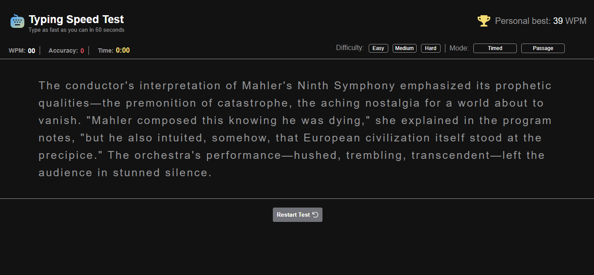

# Frontend Mentor - Typing Speed Test solution

This is a solution to the [Typing Speed Test challenge on Frontend Mentor](https://www.frontendmentor.io/challenges/typing-speed-test). Frontend Mentor challenges help you improve your coding skills by building realistic projects. 

## Table of contents

- [Overview](#overview)
  - [The challenge](#the-challenge)
  - [Screenshot](#screenshot)
  - [Links](#links)
- [My process](#my-process)
  - [Built with](#built-with)
  - [What I learned](#what-i-learned)
  - [Continued development](#continued-development)
  - [AI Collaboration](#ai-collaboration)
- [Author](#author)


## Overview

### The challenge

Users should be able to:

- View the optimal layout for the interface depending on their device's screen size
- See hover and focus states for all interactive elements on the page
- User should be able to choose the time and mode in which they want to type.
- When typing, users should be able type and clean errors they make
- Users should be able to see their time counting down, their word per minute and their rate of accuracy(Which normally counts and also when they types a wrong letter it shows red and green when vice versa).
- Users should be able to see their personal best so as to improve their typing
- See the welcoming page after typing when new to the game, which welcomes them to the game
- Continue the game, there is a page always encouraging them to improve.
- Beat their personal best,when a user beats their personal best, a page shows up to congragulate them
- Restart the game, there is a restart/return button for all the pages that shows up when a user stops typing
- See their stats when done typing so as to beat it i.e WPM, characters typed and accuracy.
- Above all, have a nice time...


### Screenshot




### Links

- Live Site URL: [Typing-test.com](https://typing-test-com.vercel.app/)

## My process

### Built with

- Semantic HTML5 markup
- CSS custom properties
- Flexbox
- CSS Grid
- Mobile-first workflow
- JavaScript


### What I learned

I learnt how to:

- How to create a timer with javaScript

```html
<p class="timer">
   Time: <span class="timer-fig">0:<span class="sec" id="sec">00</span></span>
</p>

<div class="timed-reader">
    <button class="timed" id="timed">Timed </button>
    <div class="sec-int">
        <button class="one-sec-mk" id="oneSecMk">60 Sec</button>
        <button class="two-sec-mk" id="twoSecMk">30 Sec</button>
        <button class="three-sec-mk" id="threeSecMk">15 Sec</button>
    </div>

</div>
```

```css
/* TIMED READER */
.timed{
    padding: 3px;
    font-size: 12px;
    width: 100px;
    border-radius: 4.5px;
    border: 1px solid hsl(240, 1%, 59%);
    background-color: hsl(0, 0%, 7%);
    color: #fff;
    outline: none;
    cursor: pointer;
}

.timed:hover{
    border: 1px solid hsl(214, 100%, 55%);
    color: hsl(214, 100%, 55%);
}


.sec-int{
    display: none;
    flex-direction: column;
    margin-top: 15px;
    gap: 10px;

    transition: all 0.5s ease-in;
}

.sec-int.active{
    display: flex;
}

.one-sec-mk{
    padding: 3px;
    font-size: 12px;
    width: 100px;
    border-radius: 4.5px;
    border: 1px solid hsl(240, 1%, 59%);
    background-color: hsl(0, 0%, 7%);
    color: #fff;
    outline: none;
    cursor: pointer;
}

.two-sec-mk{
    padding: 3px;
    font-size: 12px;
    width: 100px;
    border-radius: 4.5px;
    border: 1px solid hsl(240, 1%, 59%);
    background-color: hsl(0, 0%, 7%);
    color: #fff;
    outline: none;
    cursor: pointer;
}

.three-sec-mk{
    padding: 3px;
    font-size: 12px;
    width: 100px;
    border-radius: 4.5px;
    border: 1px solid hsl(240, 1%, 59%);
    background-color: hsl(0, 0%, 7%);
    color: #fff;
    outline: none;
    cursor: pointer;
    z-index: 20000;
}
```

```js
/* Initiation of the timer */
const firstSec = document.getElementById("oneSecMk");
const secondSec = document.getElementById("twoSecMk");
const threeSec = document.getElementById("threeSecMk");

let time = 60;
let started = false;
let interval;
let originalTime = 60;

firstSec.addEventListener("click", () => {
  setTime(60);
  secInt.classList.remove("active");
  modeBtns.classList.remove("active");
  

});


secondSec.addEventListener("click", () => {
  setTime(30);
  secInt.classList.remove("active");
  modeBtns.classList.remove("active");
  

});


threeSec.addEventListener("click", () => {
  setTime(15);
  secInt.classList.remove("active");
  modeBtns.classList.remove("active");
  

  
});

function setTime(value) {
  clearInterval(interval);
  time = value;
  originalTime = value;
  started = false;
  timer.innerText = String(time).padStart(2, "0");
}
```

- I learnt how to make wpm with js

```js
/* Function for calculating wpm */

const wpmEl = document.getElementById("wpmFig");

function calculateWPM() {
  const letters = document.querySelectorAll("#text span");

  let correct = 0;

  for (let i = 0; i < index; i++) {
    if (letters[i].style.color === "lightgreen") {
      correct++;
    }
  }

  const timePassed = (originalTime - time) / 60;

  if (timePassed <= 0) return 0;

  const wpm = Math.round((correct / 5) / timePassed);

  return isFinite(wpm) ? wpm : 0;
}

```
- I learnt how to make an accuracy counter with js

```js
/* Function for calculating Accuracy */
const accuEl = document.getElementById("accuFig");

function calculateAccuracy() {
  const letters = document.querySelectorAll("#text span");

  let correct = 0;

  for (let i = 0; i < index; i++) {
    if (letters[i].style.color === "lightgreen") {
      correct++;
    }
  }

  if(index === 0 ) return 100;

  return Math.round((correct / index) * 100);

 /* return accuracy; */
}
```
- I learnt how to make a personal best/highScore with javaScript using localStorage

```js
/* Knowing the new or personal best */
const highScoreEl = document.getElementById("bestNumb");

/* Show saved high score when page loads */
highScoreEl.innerText =
  localStorage.getItem("highScore") || 0;

/* Save new personal best */
function saveHighScore() {

  const currentWPM = calculateWPM();

  const savedHighScore =
    Number(localStorage.getItem("highScore")) || 0;

  if (currentWPM > savedHighScore) {

    localStorage.setItem("highScore", currentWPM);

    highScoreEl.innerText = currentWPM;

  }

}
```
I learnt a lot that I cannot highlight here, you can check the code
- I learnt how to swtich to different pages
- I improved on my flexbox and grid
- I learnt how to make a character counter
- I learnt how use Json(Very important)
- I learnt how to change different passages from json


### Continued development

I will continue my web development process by building and knowing more


### AI Collaboration

- I used Chatgpt
- Debugging, knowing syntax I don't know before, helped in checking where I got things wrong, etc
- A lot worked well


## Author
- Frontend Mentor - [@Wizdev0](https://www.frontendmentor.io/profile/Wizdev0)
- Twitter - [@otutech](https://www.twitter.com/otutech)

